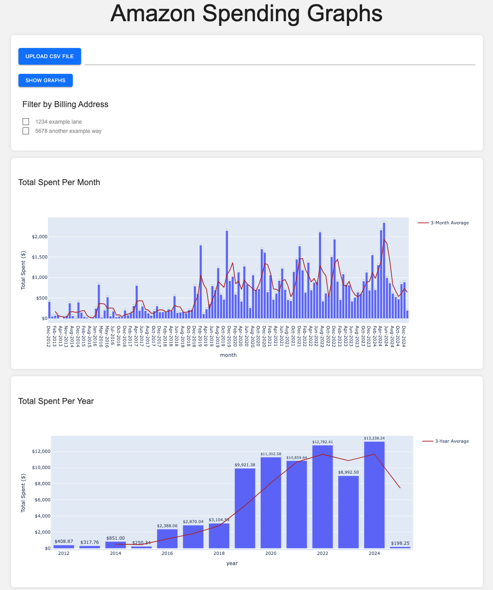

# Amazon Purchase Trends

Upload amazon purchase data and get a few graphs of trends.

## Getting Spending Data / Usage

1. Go to https://www.amazon.com/hz/privacy-central/data-requests/preview.html
1. Select the data category of 'Your Orders' and click submit request


3. It takes a few hours but you will get an email to download the files. When the zip file downloads unzip it and take note of the csv file from the Retail.OrderHistory.1 folder called Retail.OrderHistory.1.csv.

4. In the app click upload csv file, select the Retail.OrderHistory.1.csv, and then click show graphs

## Installation

### Build Image Locally

1. Clone the repository:
   ```sh
   git clone https://github.com/abrazier/amazon_purchases.git
   ```
1. Build the docker image:
   ```
   docker build -t amazon_purchases .
   ```
1. Update the docker-compose.yml as needed
1. Run compose:
   ```
   docker compose up -d
   ```

### Pull from GHCR

1. ```
   docker pull ghcr.io/abrazier/amazon_purchases:latest
   ```

## Screenshots

### Screenshot 1



### Screenshot 2


## Features

- Upload CSV files containing Amazon purchase data
- Visualize spending data with monthly and yearly graphs
- Filter data by billing address
- Toggle between dark and light modes
